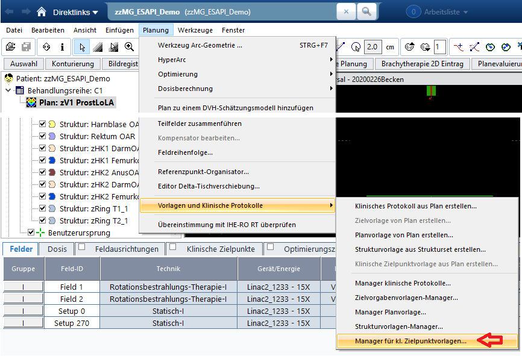

# Clinical Goals Creator From Excel (VARIAN Eclipse TPS)

This package provides Excel-first templates and a simple Excel→XML converter so users can view, adapt, and import Clinical Goals into Varian Eclipse quickly.

> Clinical Goals (CG) is a tool introduced to Varian EclipseTM planning system Version 16.0 in 2020 that objectively and visually evaluate the quality of treatment plans based upon user-defined dose-volume parameters.

## Contents

- templates/ — place example Excel templates here (e.g., T_Conv.xlsx)
- README.md — this document

## Background

This release bundle is intentionally simple: it ships ready-to-use Excel template(s) and a minimal Excel→XML converter. You can work entirely in Excel and still obtain TPS-compatible XML without additional tooling.

## What the Excel contains

Each Excel file has a sheet named `Constraints` with these columns:

- Structure IDs — canonical structure names, pipe-separated synonyms allowed; also used as aliases
- Structure Codes — numeric codes (if available)
- IDAliases — semicolon-separated aliases that become `MeasureItem` IDs in XML
- DVH Objective — metric family (e.g., Dmean, V[x], Mean[%])
- Evaluation Point — parameter for the metric (e.g., 20Gy, 10cc). May be empty for some metrics.
- Variation — acceptable variation (same unit family as the metric)
- Source — provenance (e.g., UKE, T, CHHiP, Wilkins)
- Priority — integer priority (see Rules below)
- TemplateID — template name used for grouping/preview; can be overridden per-row by `Structure IDs` if it contains `Conv`/`Fx`
- ZusatzInfo — free-form notes (optional)
- Endpoint (grade >= 3) — optional clinical endpoint info

Additionally, when rule 1 applies, the Excel `TemplateID` column is set to the `Structure IDs` string for that row (to make the override explicit).

## How to use

- Browse to `templates/` and open an example Excel (e.g., `T_Conv.xlsx`).
- Copy it and adapt rows/columns to your clinical scenario.

## Import into Eclipse (Clinical Goals)

Follow these steps in Eclipse to import the generated XML manually (one for one):

1) Navigate to External Beam Planning.
2) Open the Planning menu.
3) Select Templates and Clinical Protocols.
4) Click Clinical Goals Template Manager.
5) Click Import (bottom-left).
6) Navigate to the folder with your Clinical Goals XML and select the file.
7) Click Open.

The goals will appear in the manager and can be applied to plans.

Illustrated steps:



Alternative: put the final xml in this folder:  va_data$\ProgramData\Vision\Templates\doseobjectives

## Simplified Excel-to-XML converter

For users who only have Excel and want to directly produce XML, use `excel_to_doseobjectives.py` located in this folder.

- Script: `Release/excel_to_doseobjectives.py`
- Behavior: reads the `Constraints` worksheet; takes `Priority` exactly as given in Excel (no extra rules).
- Output: TPS-compatible DoseObjectives XML.

### Usage

```powershell
python z:/Python/ClinicalGoals/Release/excel_to_doseobjectives.py "z:/Python/ClinicalGoals/Release/templates/T_Conv.xlsx" "z:/Python/ClinicalGoals/Release/templates/T_Conv.xml"
```

Optional custom PreviewID:

```powershell
python z:/Python/ClinicalGoals/Release/excel_to_doseobjectives.py ".../T_Conv.xlsx" ".../T_Conv.xml" T_Conv
```

Batch mode (no arguments): convert all `.xlsx` in `Release/templates/` to `.xml` next to each Excel.

```powershell
python z:/Python/ClinicalGoals/Release/excel_to_doseobjectives.py
```

### Required columns in Excel

- `Structure IDs`
- `Structure Codes` (optional; used if numeric code present)
- `IDAliases` (or use `Structure IDs` as fallback)
- `DVH Objective`
- `Evaluation Point`
- `Variation` (optional)
- `Priority` (used as-is; integer)

### Info-only columns (not written to XML)

- `Source` — provenance only
- `TemplateID` — grouping label only
- `ZusatzInfo` — notes only
- `Endpoint (grade >= 3)` — clinical annotation only

These columns are helpful for humans and QA but are not expected by the TPS and are therefore not exported as XML fields.

### Requirements

- Python 3.9+
- `openpyxl` for Excel I/O:

```powershell
pip install openpyxl
```

### Quick test

1) Copy an example Excel to a working path (already done: `Release/templates/T_Conv.xlsx`).
2) Run the converter:

```powershell
python z:/Python/ClinicalGoals/Release/excel_to_doseobjectives.py "z:/Python/ClinicalGoals/Release/templates/T_Conv.xlsx" "z:/Python/ClinicalGoals/Release/templates/T_Conv.xml"
```
3) Inspect the generated XML.

## Known limitations of Clinical Goals (Eclipse)

- CI/GI: Conformity and Gradient Indices used from Varian are not robust in CG and are not exported here.
- CV constraints: Not supported by CG; therefore not exported.
- Decimal precision: Thresholds like n× values support up to one decimal place reliably; higher precision is not guaranteed in CG.
- Applicability: Clinical Goals can only be applied if all referenced structures exist in the plan's StructureSet. Remove surplus structures or create disease- and fractionation-specific XMLs (typically one XML per disease and per fractionation scheme).
